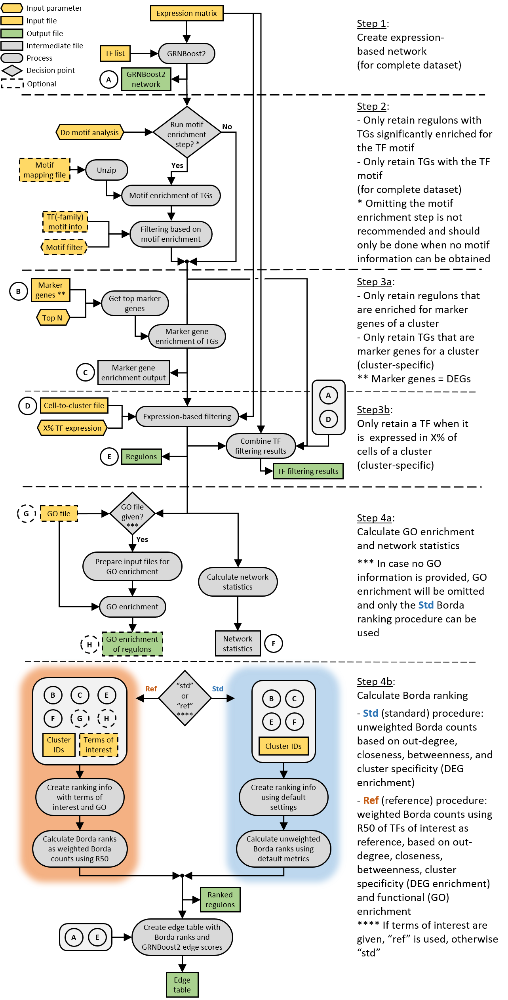

# MINI-EX

Motif-Informed Network Inference based on single-cell EXpression data  

The pipeline is built using Nextflow DSL2 and has the purpose of infer cell-type specific gene regulatory network using scRNA-Seq data in plants.  

## Pipeline summary
**1\.** Run expression-based gene regulatory network (GRN) inference ([GRNBoost2](https://arboreto.readthedocs.io/en/latest/algorithms.html#grnboost2)) given a list of transcription factors (TFs) and a gene-to-cell count matrix<br/>
**2\.** Run TF binding site (TFBS) enrichment on the expression-based regulons and filter for TF or TF-Family motifs (default TF-Family)<br/>
**3a.** Filter the previously identified regulons by target genes' (TGs) expression among the defined cell clusters (cluster specificity) using the provided markers<br/>
**3b.** Filter the cell cluster specific regulons by TF expression<br/>
**4a.** Calculate network statistics (out-degree, betweenness, closeness), cluster specificity and functional (GO) enrichment of the target genes of each regulon (if a list of GO terms is provided)<br/>
**4b.** Generate a list of ranked regulons based on Borda ranking and generate an edge table containing edge scores

For the last step, if a list of GO terms of interest is provided:
- First all the combinations of weighted metrics (network statistics, cluster specificity and functional enrichment) are evaluated
- The combination which returns half of the expected regulons earlier in the ranks (R50) is chosen for the weighted Borda ranking

else:
- The network statistics and cluster specificity are used to calculate the Borda ranking (calculated on the geometric mean of the single metrics)

**Note**: step 2 can be omitted when no motif mapping data is available (motif mapping data is provided for Arabidopsis, rice and maize). However, use with caution as without motif data the networks will be less precise.

## Detailed pipeline overview



## Inputs
* Gene-to-cell count matrix (genes as rows and cells as columns)
* List of TFs
* [Seurat](https://satijalab.org/seurat/) output from [FindAllMarkers](https://www.rdocumentation.org/packages/Seurat/versions/3.1.2/topics/FindAllMarkers)
* Tab-separated file containing the cluster identity of each cell (cell_barcode \t cluster_id)
* Tab-separated file containing the cluster annotation (cluster_id \t cluster_annotation)
* (Optional) List of GO terms of interest

As the pipeline can be run in parallel for multiple datasets all the inputs can be provided as a path to the dedicated directories.  
All input files should have specific extensions and names as shown in [here](docs/data_preparation.md).  

## Outputs
* **regulons_output folder** containing a tab-separated files with the inferred regulons, an edge table, info per TF, and an excel file with the ranked regulons and relative metadata
* **figures folder** containing a clustermap reporting the distribution of the different regulons across the cell clusters, and two heatmaps showing the cell cluster specificity and DE calls of the top 150 regulons, respectively. 
* **GOenrichment_output folder** containing a tab-separated file with GO enrichment for the different regulons with relative statistics
* **GRNBoost2_output folder** containing a TF-TG tab-separated file resulted from the GRNBoost2 run   

##   
A detailed overview on necessary input files and expected output files can be found [here](example/).


## Requirements

* [Nextflow](https://www.nextflow.io/)
* [Singularity](https://sylabs.io/guides/3.0/user-guide/index.html)


## Usage

Define paths in the [config file](docs/configuration.md) to all the required inputs.

```
nextflow -C miniex.config run miniex.nf
```
 
Having problems running MINI-EX? Check the [FAQ](docs/FAQ.md).


## Support

Should you encounter a bug or have any questions or suggestions, please [open an issue](https://github.com/VIB-PSB/MINI-EX/issues).

## Citation

When publishing results generated using MINI-EX, please cite:

Ferrari C, Manosalva Pérez N, Vandepoele K. MINI-EX: Integrative inference of single-cell gene regulatory networks in plants. Mol Plant. 2022 Nov 7;15(11):1807-1824. doi: [10.1016/j.molp.2022.10.016](https://doi.org/10.1016/j.molp.2022.10.016). Epub 2022 Oct 27. PMID: 36307979.
