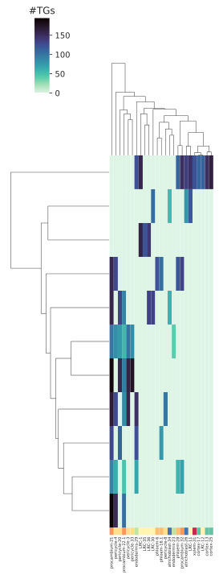
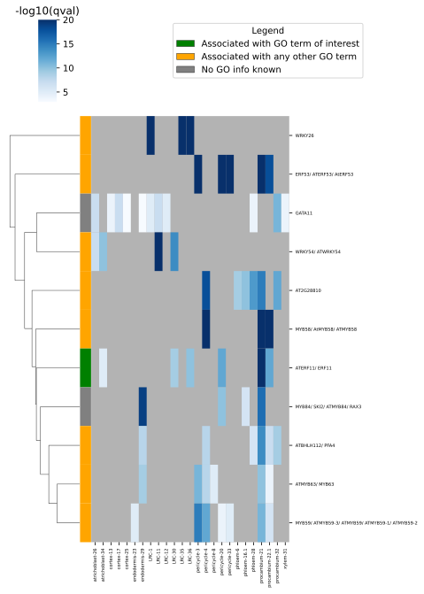
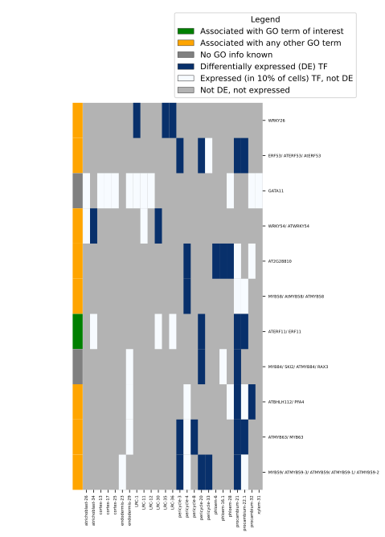

# MINI-EX example

This folder contains an example of input and output files used to run MINI-EX.  

The [INPUTS folder](INPUTS/) contains:  
 
- **miniexExample_matrix.txt**: a reduced gene-to-count matrix containing 1500 genes and 1542 cells.  
- **miniexExample_allMarkers.txt**: the output of Seurat FindAllMarkers filtered for genes present in the reduced expression matrix.  
- **miniexExample_cell2clusters.txt**: the file containing the identity of each cell present in the reduced expression matrix.  
- **miniexExample_identities.txt**: the file containing the identity of each cell cluster.  
- **TF_list.txt**: the file containing 1879 Arabidopsis TFs.  
- **GOIwant.txt**: the file containing terms related to the regulons's expected functions.  
  
  
  
The [OUTPUTS folder](OUTPUTS/) contains four sub-folders:   
- **GRNBoost2_output** containing the output of GRNBoost2.  
- **GOenrichment_output** containing the output of the functional enrichment of the inferred regulons.    
- **regulons_output** containing two files:  
	- miniexExample_regulons.txt, a tab-separated file with TF, cell cluster and list of TGs for each of the inferred regulons.  
	- miniexExample_rankedRegulons.xlsx, an excel file containing metadata for each of the inferred regulons. The different columns are explained below:    
		- TF: TF gene name (i.e. AT1G71930) 
		- alias: TF alias (i.e. VND7)  
		- hasTFrelevantGOterm: 'relevant_known_TF' if the TF is associated to a relevant GO term (relative to [GOIwant.txt](https://github.com/VIB-PSB/MINI-EX/tree/main/example/INPUTS/GOIwant.txt)), 'known_TF' if the TF is associated to another experimentally validated and/or manually curated GO term, 'unknown_TF' when the TF is uncharacterized.   
		- GO: the GO term(s) the TF is associated with.     
		- GOdescription: the description of the GO term(s) associated with the TF.  
		- cluster: the cell cluster the TF acts in.    
		- celltype:  the identity of the cell cluster the TF acts in.    
		- isTF_DE: 1 if the TF is upregulated in the cell cluster it acts in, 0 if the TF is expressed (by at least 10% of the cells within the cell cluster) in the cell cluster it acts in.    
		- totRegInCluster: number of total regulons within the cell cluster.     
		- #TGs: number of TGs controlled by the regulon.    
		- qval_cluster: FDR-corrected pvalue of cell cluster enrichment (Expression specificity).    
		- closeness: closeness-centrality.  
		- betweenness: betweenness-centrality.    
		- GO_enrich_qval: FDR-corrected pvalue of functional enrichment of the regulon's TGs (Functional specificity).  
		- GO_enrich_term: relevant GO terms (relative to [GOIwant.txt](https://github.com/VIB-PSB/MINI-EX/tree/main/example/INPUTS/GOIwant.txt)) for which the regulon's TGs are enriched for.    
		- GO_enrich_desc: description of the GO term(s)for which the regulon's TGs are enriched for.    
		- #TGs_withGO: number of TGs enriched for the relevant GO terms.    
		- borda_rank: global Borda ranking of the regulon.  
		- borda_clusterRank: cluster-specific Borda ranking of the regulon.  
		
- **figures** containing the three default figures MINI-EX produces:  
	- miniexExample_clustermap.svg, a clustermap showing the number of TGs per TF (y-axis) across the different single cell clusters   
	   
	
	- miniexExample_heatmapSpecificity.svg, a clustermap reporting the specificity of expression of the top 150 regulons across the different single cell clusters  
	  
	
	- miniexExample_heatmapDEcalls.svg, a clustermap reporting whether the top 150 TFs are upregulated (blue) or just expressed (white) in the cell cluster they act  
	  
	
		