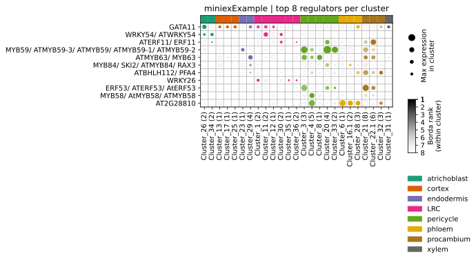

# MINI-EX example

This folder contains an example of input and output files used to run MINI-EX.  

The [INPUTS folder](INPUTS/) contains:  
 
- **miniexExample_matrix.tsv**: a reduced gene-to-count matrix containing 1500 genes and 1542 cells  
- **miniexExample_allMarkers.tsv**: the output of Seurat FindAllMarkers filtered for genes present in the reduced expression matrix  
- **miniexExample_cells2clusters.tsv**: the file containing the identity of each cell present in the reduced expression matrix  
- **miniexExample_identities.tsv**: the file containing the identity of each cell cluster
- **miniexExample_identities_with_idx.tsv**: the file containing the identity and index (for sorting clusters in the regulator heatmap) of each cell cluster. Only one of `miniexExample_identities.txt` or `miniexExample_identities_with_idx.txt` should be provided.
- **GOsIwant.tsv**: (optional, it can be set to null) the file containing terms related to the regulons's expected functions
- **EnrichmentBackground.tsv**: (optional, it can be set to null) the file containing gene IDs to be used as background for the enrichment analysis
  
The [OUTPUTS folder](OUTPUTS/) contains four sub-folders + the log file:
- **Log file** containing statistics on the provided dataset(s), information on the provided input files and parameters, as well as intermediary results in the workflow
- **grnboost2** containing the output of GRNBoost2  
- **go_enrichment** containing the output of the functional enrichment of the inferred regulons    
- **regulons** containing four files:  
	- miniexExample_TF_info_file.tsv, a tab-separated file containing, for each TF, information about the TF's expression, whether it was retained or not in the final regulons list, and if not, at which step it was discarded. It also reports the percentage of cells for each cluster expressing the TF. This can be useful for adjusting the **expressionFilter** parameter in the last block of the [config file](https://github.com/VIB-PSB/MINI-EX/tree/main/docs/configuration.md).         
	- miniexExample_regulons.tsv, a tab-separated file with TF, cell cluster and list of TGs for each of the inferred regulons  
	- miniexExample_edgeTable.tsv, a tab-separated file that lists all inferred edges: TF, TG, cell cluster, borda_rank (see below), borda_clusterRank (see below), weight (GRNBoost2 edge weight)  
	- miniexExample_rankedRegulons.xlsx (also available in tsv format), an excel file containing metadata for each of the inferred regulons. The different columns are explained below:
		- TF: TF gene name (i.e. AT1G71930) 
		- alias: TF alias (i.e. VND7)  
		- hasTFrelevantGOterm: 'relevant_known_TF' if the TF is associated to a relevant GO term (relative to [GOsIwant.tsv](https://github.com/VIB-PSB/MINI-EX/tree/main/example/INPUTS/GOsIwant.tsv)), 'known_TF' if the TF is associated to another experimentally validated and/or manually curated GO term, 'unknown_TF' when the TF is uncharacterized   
		- GOterm: the GO term(s) the TF is associated with     
		- GOdescription: the description of the GO term(s) associated with the TF  
		- cluster: the cell cluster the TF acts in    
		- celltype:  the identity of the cell cluster the TF acts in    
		- isTF_DE: 1 if the TF is upregulated in the cell cluster it acts in, 0 if the TF is expressed (by at least 10% of the cells within the cell cluster) in the cell cluster it acts in    
		- totRegInCluster: number of total regulons within the cell cluster     
		- #TGs: number of TGs controlled by the regulon    
		- qval_cluster: FDR-corrected p-value of cell cluster enrichment of target genes (cluster specificity)
		- out-degree: out-degree of the TF 
		- closeness: closeness-centrality  
		- betweenness: betweenness-centrality
		- med_coexpr: median coexpression of the TF with its target genes
		- TF_qval: FDR-corrected p-value of cluster specificity of the TF
		- GO_enrich_qval (only present if 'termsOfInterest' is not null): FDR-corrected p-value of functional enrichment of the regulon's TGs (functional specificity - reporting only the lowest p-value among the relevant terms)  
		- GO_enrich_term (only present if 'termsOfInterest' is not null): the relevant GO term (relative to [GOsIwant.tsv](https://github.com/VIB-PSB/MINI-EX/tree/main/example/INPUTS/GOsIwant.tsv)) for which the regulon's TGs showed the most significant enrichment    
		- GO_enrich_desc (only present if 'termsOfInterest' is not null): description of the GO term for which the regulon's TGs showed the most significant enrichment    
		- #TGs_withGO (only present if 'termsOfInterest' is not null): number of TGs enriched for the most significant relevant GO term    
		- borda_rank: global Borda ranking of the regulon  
		- borda_clusterRank: cluster-specific Borda ranking of the regulon  
		
- **figures** containing the four default figures MINI-EX produces, available in both SVG and PNG formats:
	- miniexExample_clustermap, a clustermap showing the number of TGs per TF (y-axis) across the different single cell clusters (x-axis)   
	   
	
	- miniexExample_heatmapSpecificity, a clustermap reporting the specificity of expression of the top 150 regulons across the different single cell clusters. Each TF is color coded accoring to the GO terms associated to it, in green for 'relevant_known_TF', in yellow for 'known_TF', and gray for 'unknown_TF'
	  
	
	- miniexExample_heatmapDEcalls, a clustermap reporting whether the top 150 TFs are upregulated (blue) or just expressed (by at least 10% of the cells within the cell cluster - white) in the cell cluster they act. Each TF is color coded accoring to the GO terms associated to it, in green for 'relevant_known_TF', in yellow for 'known_TF', and gray for 'unknown_TF'
	  
	
	- miniexExample_regmap_x, a heatmap reporting top x TFs (default x range: 10, 25, 50, 100, "topRegs", all) per cluster, showing the maximum expression (mean of top 3 cells) per cluster and the respective ranking (borda_clusterRank). Clusters (i.e. columns) are sorted based on the index given in `miniexExample_identities_with_idx.tsv`, allowing to track predicted regulators over predefined lineage. If `miniexExample_identities.tsv` is provided instead, the clusters will be ordered as provided in this input file. These figures can be easily produced for additional thresholds/settings using the additionally provided `regmap.sh` script. Call `python3 bin/MINIEX_regmap.py -h` for additional parameters. Note: only regmaps having less than 40 TFs are generated in the PNG format

    	
